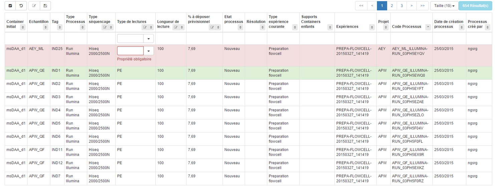

# Errors



> The Ultimate DataTable has it own way to handle errors. In order to use the built-in functions, your errors need to look like this :


```json
{
	"thePropertyName":["Error1","Error2"],
	"thePropertyName2":["Error1","Error2"]
}
```

> And the status code of the HTTP response need to be an error one (like 4xx or 5xx etc...)