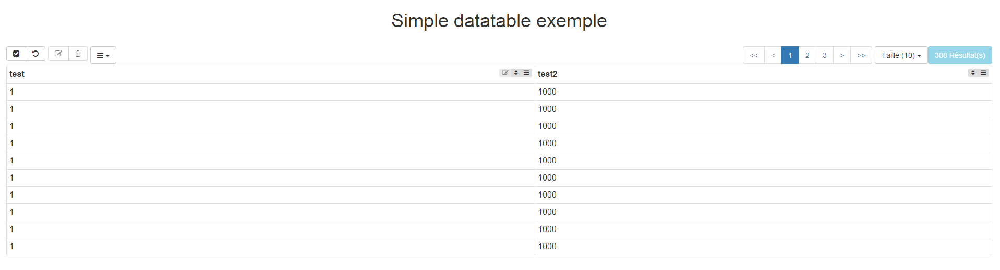

#   Welcome to the Ultimate DataTable project page

> This [AngularJS](http://www.angularjs.org) directive generate a HTML table with build-in fonctionnality like save, edit, remove, pagination etc...
You can [fork this project in GitHub](https://github.com/institut-de-genomique/Ultimate-DataTable/) to help us out !

> **Keep in mind that this documentation is a work in progress**

##Versions
> **Current stable version** : 3.3.0<br>
**Latest version** : 3.3.1-SNAPSHOT


## Quick start
[](http://institut-de-genomique.github.io/Ultimate-DataTable/)
###  Dependencies
> The Ultimate DataTable need the folowing components to be fully fonctionnal :
<ul>
	<li>The Ultimate DataTable js file</li>
	<li>The Ultimate DataTable css file</li>
	<li><a href="https://angularjs.org/">AngularJS</a></li>
	<li><a href="https://jquery.com/">Jquery</a></li>
	<li><a href="http://getbootstrap.com/">Bootstrap CSS and Javascript (3.x)</a></li>
	<li><a href="http://fortawesome.github.io/Font-Awesome/">Font Awesome</a></li>
	<li><a href="http://momentjs.com/">MomentJS</a> If you use dates</li>
</ul>
```html
 <link rel="stylesheet" href="http://institut-de-genomique.github.io/Ultimate-DataTable/js/bootstrap/css/bootstrap-3.3.4.min.css">
 <link rel="stylesheet" href="http://institut-de-genomique.github.io/Ultimate-DataTable/js/font-awesome/css/font-awesome.min.css">
 <link rel="stylesheet" href="http://institut-de-genomique.github.io/Ultimate-DataTable/css/ultimate-datatable-3.3.1-SNAPSHOT.css">
 <script src="http://institut-de-genomique.github.io/Ultimate-DataTable/js/jquery/jquery_1.11.1.min.js" type="text/javascript" charset="utf-8"></script>
 <script src="http://institut-de-genomique.github.io/Ultimate-DataTable/js/bootstrap/js/bootstrap-3.3.4.min.js" type="text/javascript" charset="utf-8"></script>
 <script src="http://institut-de-genomique.github.io/Ultimate-DataTable/js/angular-js/angular-1.3.16.min.js" type="text/javascript" charset="utf-8"></script>
  <script src="http://institut-de-genomique.github.io/Ultimate-DataTable/js/momentjs.js" type="text/javascript" charset="utf-8"></script>
 <script src="http://institut-de-genomique.github.io/Ultimate-DataTable/js/ultimate-datatable-3.3.1-SNAPSHOT.js" type="text/javascript" charset="utf-8"></script>
```

### HTML
```html
<body ng-app="ngAppDemo">
 <div class="container-fluid">
	<div class="row">
		<h1 align=center>Simple Ultimate DataTable exemple</h1><br>
		<div ng-controller="ngAppDemoController">
			<div class="col-md-12 col-lg-12" ultimate-datatable="datatable">
			</div>
		</div>
	</div>
 </div>
</body>
```

### Javascript
```javascript
angular.module('ngAppDemo', ['ultimateDataTableServices']).controller('ngAppDemoController', ['$scope','datatable',function($scope,datatable) {
		
	//Simple example of configuration
		var datatableConfig = {
			"name":"simple_datatable",
			"columns":[
				{
					"header":"test",
					"property":"test",
					"order":true,
					"type":"text",
					"edit":true
				},
				{
					"header":"test2",
					"property":"test2",
					"order":true,
					"type":"text"
				}
			],
			"edit":{
				"active":true,
				"columnMode":true
			},
			"pagination":{
				"mode":'local'
			},
			"order":{
				"mode":'local'
			},
			"remove":{
				"active":true,
				"mode":'local'
			}
		};

		//Simple exemple of data
		var datatableData = [{"test":1, "test2":1000},{"test":1, "test2":1000},{"test":1, "test2":1000},
		{"test":1, "test2":1000},{"test":1, "test2":1000},{"test":1, "test2":1000},
		{"test":1, "test2":1000}];
		
		//Init the datatable with his configuration
		$scope.datatable = datatable(datatableConfig);
		//Set the data to the datatable
		$scope.datatable.setData(datatableData);
}]);
```		
